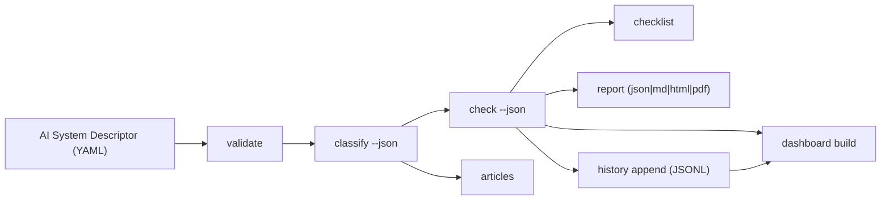
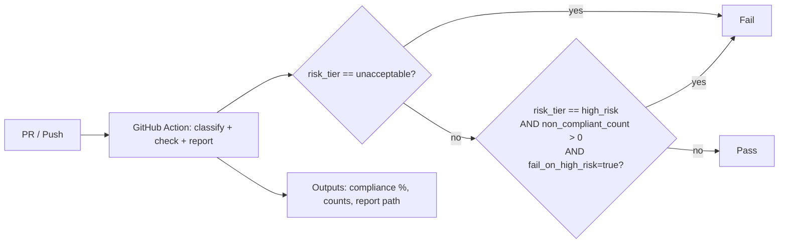

[](https://github.com/ogulcanaydogan/eu-ai-act-compliance-kit/actions/workflows/ci.yml)
[](https://github.com/ogulcanaydogan/eu-ai-act-compliance-kit/actions/workflows/release.yml)
[](https://pypi.org/project/eu-ai-act-compliance-kit/)
[](https://eu-ai-act-compliance-kit.readthedocs.io)
[](https://www.python.org/downloads/)
[](LICENSE)

# EU AI Act Compliance Kit

Open-source toolkit to operationalize **EU AI Act (Regulation 2024/1689)** obligations.  
It classifies AI systems by risk tier, evaluates compliance evidence, generates actionable checklists, and produces audit-ready reports.

## Why This Exists

Teams building AI for EU markets need a practical path from policy text to engineering controls. This project provides that path:

- **Risk classification** (`unacceptable`, `high_risk`, `limited`, `minimal`)
- **Evidence-based compliance checks** (status model: `compliant`, `partial`, `non_compliant`, `not_assessed`)
- **Checklist and remediation workflow** tied to article-level obligations
- **Auditable reporting** in `json`, `md`, `html`, `pdf`
- **CI/CD + pre-push gates** aligned with deterministic fail policy
- **History and dashboard artifacts** for trend visibility across systems

## End-to-End Pipeline



## CI/CD and Action Gate Flow



## Quick Start

### Install

```bash
pip install eu-ai-act-compliance-kit
# or
pip install -e .
```

For PDF export support:

```bash
pip install -e ".[reporting]"
```

### Run

```bash
ai-act validate examples/medical_diagnosis.yaml
ai-act classify examples/medical_diagnosis.yaml --json
ai-act check examples/medical_diagnosis.yaml --json
ai-act checklist examples/medical_diagnosis.yaml --format md -o checklist.md
ai-act report examples/medical_diagnosis.yaml --format html -o report.html
ai-act export check examples/medical_diagnosis.yaml --target generic --json
```

## CLI Surface

- `ai-act classify <system.yaml> [--json]`
- `ai-act check <system.yaml> [--json]`
- `ai-act checklist <system.yaml> [--format json|md|html]`
- `ai-act transparency <system.yaml> [--json]`
- `ai-act gpai <model.yaml> [--json]`
- `ai-act report <system.yaml> [--format json|md|html|pdf]`
- `ai-act validate <system.yaml>`
- `ai-act articles [--tier minimal|limited|high_risk|unacceptable]`
- `ai-act history list|show|diff`
- `ai-act dashboard build <descriptor_dir> [--recursive] [--include-history]`
- `ai-act export check <system.yaml> --target jira|servicenow|generic [--output PATH] [--history-path PATH] [--json] [--push] [--push-mode create|upsert] [--dry-run] [--idempotency-path PATH] [--disable-idempotency]`
- `ai-act export history <event_id> --target jira|servicenow|generic [--output PATH] [--history-path PATH] [--json] [--push] [--push-mode create|upsert] [--dry-run] [--idempotency-path PATH] [--disable-idempotency]`
- `ai-act export batch <descriptor_dir> --target jira|servicenow|generic [--recursive] [--output PATH] [--json] [--push] [--push-mode create|upsert] [--dry-run] [--idempotency-path PATH] [--disable-idempotency]`
- `ai-act export reconcile --target jira|servicenow [--idempotency-path PATH] [--system NAME] [--requirement-id ID] [--limit N] [--output PATH] [--json]`
- `ai-act export ledger list [--idempotency-path PATH] [--target jira|servicenow|generic] [--system NAME] [--requirement-id ID] [--limit N] [--json]`
- `ai-act export ledger stats [--idempotency-path PATH] [--json]`

Full reference: [docs/cli-reference.md](docs/cli-reference.md)

## Example Systems

- `examples/medical_diagnosis.yaml` (high risk)
- `examples/hiring_tool.yaml` (high risk)
- `examples/social_scoring.yaml` (unacceptable)
- `examples/chatbot.yaml` (minimal)
- `examples/spam_filter.yaml` (minimal)
- `examples/public_benefits_triage.yaml` (high risk with expected compliance gaps)
- `examples/synthetic_media_campaign_assistant.yaml` (limited/transparency-heavy)
- `examples/gpai_model.yaml` / `examples/gpai_model_low_risk.yaml` / `examples/gpai_model_unknown_thresholds.yaml`

## GitHub Action Contract

Action entrypoint: [`action.yml`](action.yml)

Outputs:

- `risk_tier`
- `compliance_percentage`
- `report_path`
- `articles_applicable`
- `total_requirements`
- `compliant_count`
- `non_compliant_count`
- `partial_count`
- `not_assessed_count`

Fail policy:

- `unacceptable` always fails
- `high_risk` fails only when `fail_on_high_risk=true` and `non_compliant_count > 0`

## For UK Global Talent Evidence

This repository is structured to generate verifiable signals of technical impact:

- **Measurable output artifacts**: compliance reports, checklist items, history events, static dashboards
- **Release discipline**: semver tag-driven pipeline (`qa-build -> trusted PyPI publish -> GitHub Release`)
- **Open contribution readiness**: CI, tests, docs, contribution guide, roadmap, changelog
- **Public traceability**: issues, PRs, release notes, and workflow history

Evidence-friendly links:

- Repo: <https://github.com/ogulcanaydogan/eu-ai-act-compliance-kit>
- Docs: <https://eu-ai-act-compliance-kit.readthedocs.io>
- Launch Evidence: [docs/launch_evidence_v0_1_0.md](docs/launch_evidence_v0_1_0.md)
- Roadmap: [ROADMAP.md](ROADMAP.md)
- Changelog: [CHANGELOG.md](CHANGELOG.md)
- Contributing: [CONTRIBUTING.md](CONTRIBUTING.md)

## Open-Core Boundary (Commercial Strategy)

### Open-source scope (Apache-2.0)

- Core compliance engine (classification/checker/checklist/transparency/gpai)
- CLI + report generation + local history/dashboard
- Documentation, examples, and CI integration

### Reserved commercial scope (private)

- Enterprise policy packs and jurisdiction overlays
- Managed multi-tenant dashboard / hosted compliance ops
- Advisory automation and premium support SLAs
- Proprietary integrations and deployment controls

## Development

```bash
pip install -e ".[dev,docs]"
pytest -q
mkdocs build --strict
```

## First Contribution Path

```bash
pip install -e ".[dev,docs]"
./scripts/quickstart_smoke.sh
pre-commit install --hook-type pre-push
pre-commit run --hook-stage pre-push --all-files
```

If all checks pass, pick a small docs or test issue, open a focused PR, and
include command outputs in the PR description.

Local pre-push gate:

```bash
pre-commit install --hook-type pre-push
pre-commit run --hook-stage pre-push --all-files
```

## Documentation

- [Documentation Home](docs/index.md)
- [Installation](docs/installation.md)
- [Quickstart](docs/quickstart.md)
- [CLI Reference](docs/cli-reference.md)
- [API Reference](docs/api-reference.md)
- [Custom Systems](docs/custom-systems.md)
- [Examples](docs/examples.md)
- [Adoption Evidence Template](docs/adoption_evidence_template.md)

## Roadmap Status

- Phase 1-12: completed (including v0.1.0 launch closure)
- Phase 13: adoption hardening completed
- Phase 14: external export core completed (payload-first, no live API push)
- Phase 15: CI/release runtime hardening completed (Node20 deprecation cleanup + security gate stabilization)
- Phase 16: live export push completed (strict fail-fast + retry/backoff controls for `--push`)
- Phase 17: export push production hardening completed (create-only idempotency ledger + duplicate-safe push)
- Phase 18: export operator observability + upsert push completed (`export ledger list|stats` + lookup-first upsert mode)
- Phase 19: export ops hardening completed (`export batch` + `export reconcile` for operational reliability)
- Phase 20: quality and coverage hardening completed (example matrix + CI/test contract gates)
- Phase 21: export v3 reliability completed (reconcile drift detection + guarded repair with explicit `--apply`)
- Phase 22: export v4 ops completed (persistent ops log + `export replay` and `export rollup`)

## Disclaimer

This project provides technical compliance signals and engineering guidance. It is not legal advice.

## License

Apache License 2.0. See [LICENSE](LICENSE).
